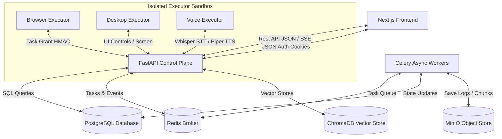

# AETHER MASTER CONTEXT

Welcome to **AETHER OS**, the core developer environment and Single Source of Truth (SSoT) for the Aether Personal AI Automation Platform. This document is a living resource that maps the entire architecture, API routes, database schemas, and codebase constraints of the project. Every future AI agent (Antigravity, Cursor, Claude Code, ChatGPT, etc.) **must** read and adhere to this file before planning or executing changes.

---

## 1. Project Overview

*   **Project Name**: Aether AI Automation Platform
*   **Purpose**: An offline-first, private, and secure personal assistant orchestration layer designed to execute local automation (browser, desktop, CLI) and manage user context, workflows, and tools dynamically.
*   **Vision**: To deliver a beautiful visual HUD ("AETHER OS") that simplifies user intent into reliable background workflows, using scoped permissions, explicit approval gates, and rigorous data protection boundaries.
*   **Architecture Summary**: A modular web client built in Next.js communicating with a FastAPI control plane, backed by Celery/Redis for background workflows, PostgreSQL for metadata, and ChromaDB for vector memory. Fully containerized with dedicated micro-service sandboxes for untrusted execution (such as browser and desktop automation).

---

## 2. Current Architecture



*   **Frontend**: Next.js (App Router, React 19, TypeScript), styled with vanilla CSS and design utility tokens (slate-zinc glassmorphism, animated neon telemetry rings, responsive 3-column command deck). Live audio telemetry drives an HTML5 Canvas rendering engine.
*   **Backend**: FastAPI (Python 3.12+), utilizing SQLAlchemy (asyncio/asyncpg dialect) for data queries and Pydantic v2 for data schema modeling.
*   **Database**: PostgreSQL 16+ as the source of truth for transactional states, workflow logs, and user data.
*   **AI Stack**: Provider-neutral gateway wrappers with an OpenAI-compatible adapter. Supports local SHA-256 fallback mock embeddings in development to enable fully offline validation.
*   **Authentication**: Multi-tenant session state verified by JWT tokens stored in secure, HTTP-only cookies. Provides a `/v1/auth/bypass` route for local development sign-in.
*   **Storage**: MinIO-compatible object storage emulator, abstracted by a `LocalArtifactStore` locally storing files under hashed organization-scoped paths.
*   **External Services**: Sandboxed executors for browser automation (Playwright/Node) and desktop automation (Xvfb/xdotool/scrot in Linux containers).

---

## 3. Folder Structure

```text
├── apps/
│   └── web/                               # Next.js Frontend Application
│       ├── app/                           # App Router page components & layouts
│       ├── components/                    # Page-specific modular UI components
│       │   ├── voice/                     # Premium Aether OS voice assistant console UI
│       │   └── chat/                      # Unified chat interaction decks
│       ├── lib/                           # Frontend API clients & utility hooks
│       └── eslint.config.mjs              # Custom linting definitions
├── backend/                               # FastAPI Backend Control Plane
│   ├── database/
│   │   └── schema/                        # Sequential SQL migrations (0001 - 0020)
│   ├── src/
│   │   └── aether/
│   │       ├── ai/                        # OpenAI Chat & Embeddings gateways
│   │       ├── auth/                      # Session manager & JWT middleware
│   │       ├── bootstrap/                 # Lifespan startup, settings, DB engine
│   │       ├── document/                  # RAG parsing, layout layout, & chunking
│   │       ├── infrastructure/            # SQLAlchemy database repositories
│   │       ├── interfaces/                # HTTP routes mapped by FastAPI routers
│   │       ├── memory/                    # Consented long-term memory handlers
│   │       ├── voice/                     # Audio validation, grantees, and intents
│   │       └── automation/                # Celery triggers and outbox workers
│   └── tests/                             # Pytest integration & unit tests
├── docs/                                  # Repository documentation & design docs
└── services/                              # Hardened runner containers
    ├── browser-executor/                  # Playwright container executor
    ├── desktop-executor/                  # Linux X11 virtual display automation
    └── voice-executor/                    # Whisper STT & Piper TTS containers
```

---

## 4. Core Modules

### 4.1 Chat
*   **Purpose**: Manages multi-turn conversation timelines and coordinates RAG retrieval/injection.
*   **Current Status**: Complete. Reuses user-approved long term memory context files.
*   **Dependencies**: `aether.ai.chat`, `aether.memory.service`.
*   **Entry Files**:
    *   Backend: `backend/src/aether/interfaces/http/chat.py`
    *   Frontend: `apps/web/app/chat/page.tsx`
*   **Known Issues**: None.
*   **Future Plans**: Integration with visual agent planning pipelines.

### 4.2 Voice
*   **Purpose**: Ephemeral capture, transcription (Whisper), intent execution, and synthesis feedback (Piper).
*   **Current Status**: Debug-complete. Custom `DevDebugPanel` is rendered in development mode to telemetry pipeline states.
*   **Dependencies**: Web Audio API, MediaRecorder, `window.speechSynthesis`.
*   **Entry Files**:
    *   Backend: `backend/src/aether/interfaces/http/voice.py`
    *   Frontend: `apps/web/components/voice/voice-workspace.tsx`
*   **Known Issues**: Mock audio fallback required in headless browser test runs.
*   **Future Plans**: Streaming voice input pipeline via WebSockets.

### 4.3 Documents & RAG
*   **Purpose**: Ingest local text, CSV, PDF, or DOCX documents, partition them into semantic chunks, and query content similarity.
*   **Current Status**: Complete.
*   **Dependencies**: `OpenAICompatibleEmbeddingGateway`, local SHA-256 fallback mock vectorizer.
*   **Entry Files**:
    *   Backend: `backend/src/aether/interfaces/http/documents.py`, `backend/src/aether/document/`
    *   Frontend: `apps/web/app/documents/page.tsx`
*   **Known Issues**: High memory footprint during PDF indexing in local development.
*   **Future Plans**: Support for asynchronous OCR parsing.

### 4.4 Long-Term Memory (LTM)
*   **Purpose**: Stores structured user preferences and context across chats with opt-in governance.
*   **Current Status**: Complete. Strict tenant checks are enforced on read/write.
*   **Dependencies**: Postgres table `memories`, `memory_consents`.
*   **Entry Files**:
    *   Backend: `backend/src/aether/interfaces/http/memory.py`
    *   Frontend: `apps/web/app/memory/page.tsx`
*   **Known Issues**: None.
*   **Future Plans**: Automated memory decay.

### 4.5 Automation & Workflows
*   **Purpose**: Executing multi-step flows backed by a transactional outbox retry framework and human-in-the-loop approvals.
*   **Current Status**: Complete.
*   **Dependencies**: Postgres triggers, Redis, Celery tasks executor.
*   **Entry Files**:
    *   Backend: `backend/src/aether/interfaces/http/workflows.py`, `backend/src/aether/automation/`
    *   Frontend: `apps/web/app/workflows/page.tsx`
*   **Known Issues**: Celery tasks lack automated priority queue routing.
*   **Future Plans**: Drag-and-drop React Flow dashboard additions.

---

## 5. Route Map

| Relative Route | Purpose | Key UI Modules / Components | Associated APIs | Status / Notes |
| :--- | :--- | :--- | :--- | :--- |
| `/login` | Authenticate sessions | Form validator, credentials bypass | `/v1/auth/login`, `/v1/auth/bypass` | Finished |
| `/dashboard` | Overall workspace HUD | Org switchers, task updates, health indicators | `/v1/dashboard/stats` | Finished |
| `/chat` | Conversational prompt deck | Timeline, models configuration menu | `/v1/conversations/*` | Finished |
| `/voice` | Cyberpunk theme command deck | Visualizer orb canvas, timeline, telemetry telemetry panel | `/v1/voice/*` | Finished (logs added) |
| `/documents` | Document uploaded lists & searches | Drop-zone, similarity search query field | `/v1/documents/*` | Finished |
| `/memory` | View & forget LTM logs | Deletion prompts, consent slider | `/v1/memory/*` | Finished |
| `/workflows` | Manage and run tasks lists | Versions config, logs tracker | `/v1/workflows/*` | Finished |
| `/developer` | Terminal execution sandbox | Console shell emulator | `/v1/developer/*` | Finished |

---

## 6. API Map

### 6.1 Authentication
*   `GET /v1/auth/bypass`: Logs clean developer cookie session into first DB user.
*   `POST /v1/auth/login`: Signs in standard credentials and returns JWT secure cookied tokens.
*   `POST /v1/auth/refresh`: Re-issues access tokens via active parent sessions.

### 6.2 Voice Assistant
*   `PUT /v1/voice/consent`: Toggles audio capture and retention permissions.
*   `POST /v1/voice/sessions`: Launches a new active voice session.
*   `POST /v1/voice/sessions/{id}/audio`: Accepts Base64 audio blobs for Whisper transcription.
*   `POST /v1/voice/sessions/{id}/grant`: Generates an HMAC token to grant execution authorization to sandbox container.
*   `POST /v1/voice/confirmations/{id}/decision`: Confirms or rejects a parsed high-risk voice command action.
*   `POST /v1/voice/sessions/{id}/synthesize`: Requests TTS audio file output for confirmed answers.

### 6.3 Chat
*   `POST /v1/conversations`: Initializes new chat session logs.
*   `POST /v1/conversations/{id}/messages`: Appends user prompt, retrieves memory contexts, triggers LLM pipeline, and pulls relative memories.

### 6.4 Documents
*   `POST /v1/documents/upload`: Ingests document file binary and creates index chunks.
*   `POST /v1/documents/search`: Invokes cosine similarity rating against local database vectors.

---

## 7. Database Overview

The schema is divided into 20 incremental, relational SQL migration blocks. Major tables:

```
                  +-------------------+
                  |   organizations   |
                  +-------------------+
                            |
           +----------------+----------------+
           |                                 |
+--------------------+             +-------------------+
|     memberships    |             |    conversations  |
+--------------------+             +-------------------+
           |                                 |
+--------------------+                       |
|        users       |                       |
+--------------------+             +-------------------+
           |                       |     messages      |
+--------------------+             +-------------------+
|      sessions      |                       |
+--------------------+                       |
                                   +-------------------+
                                   |   voice_sessions  |
                                   +-------------------+
                                             |
                                   +-------------------+
                                   |  voice_artifacts  |
                                   +-------------------+
```

### Table Relationships
*   `memberships` binds `users` and `organizations` under a strictly validated role check (`owner`, `admin`, `member`).
*   `conversations` and `messages` represent tenant-isolated chat history.
*   `memories` records are mapped to both `organizations` and `users` to protect cross-tenant boundary leaks.
*   `voice_sessions` and `voice_consents` enforce consent parameters prior to session execution.

---

## 8. Current Progress

| Module / Feature | Phase | Status | Details |
| :--- | :--- | :--- | :--- |
| **System Blueprint** | Phase 0 | Completed | Architecture models and threat reviews established. |
| **Relational Database** | Phase 4 | Completed | Migrations (0001 - 0020) implemented cleanly. |
| **Auth & Sessions** | Phase 5 | Completed | Cookie token refresh and by-pass endpoint verified. |
| **Memory Retention** | Phase 10 | Completed | Scoped memory extraction and forget-all UI complete. |
| **Celery Automations** | Phase 11-12 | Completed | Durable task run leasing complete. |
| **Hardened Sandboxes** | Phase 13-14 | Completed | Browser and desktop isolated container code complete. |
| **Aether OS Voice HUD**| Phase 15 | Completed | Overhauled UI, visualizer engine, and console logs. |
| **Orchestrator Agents**| Phase 16 | Planned | AI developer agent scheduler models. |

---

## 9. Recent Changes

*   **2026-07-16**: Overhauled visualizer and voice controls on `/voice` page. Created `DevDebugPanel` capturing real-time pipeline parameters. Added custom `[AETHER]` logging wrappers tracing permission query metadata down to speech completion.
*   **2026-07-16**: Resolving Github Push Protection rulesets. Excluded long backup logs and removed OpenAI live key leaks from `.env.example` in commit history before force-pushing to branch `feature/aether-os-voice`.

---

## 10. Known Issues

*   **Headless Visualizer Sound Permissions**: Automated browser tests (like Puppeteer/Playwright headless engines) fail to allocate sound interfaces unless flags `--use-fake-ui-for-media-stream` and `--use-fake-device-for-media-stream` are explicitly provided.
*   **Celery Redis Leak**: Task execution outputs are cached temporarily in Redis DB 1, which may leak memory if payload size exceeds 20MB. Ensure audio recordings are capped under 10MB.
*   **Egress Control DNS Rebinding**: Egress hostname resolver lacks TTL caching protection on some development routers.

---

## 11. Technical Decisions

1.  **Shared Voice & Chat Backend**: Voice intents use existing `/v1/conversations/messages` under the hood. This enforces unified memory injection, RAG contexts, and database schemas without duplicating code.
2.  **Local Non-Prod Embeddings Mocking**: The embedding gateway falls back to a deterministic 1536-dimensional mock array based on SHA-256 of text inputs. This guarantees backend functionality offline.
3.  **HMAC Short-Lived Grants**: Subagents or executors (like Browser/Desktop containers) never see database storage. They run by validating HMAC-signed grants containing temporal parameters signed with `VOICE_GRANT_SECRET`.

---

## 12. AI Development Rules

> [!IMPORTANT]
> Guidelines that any AI Assistant/Agent must adhere to:

*   **Principle of Composition**: Do not rewrite existing backend schemas to support trivial UI tasks. Extend or aggregate endpoints utilizing the repository layer.
*   **Strict Tenant Scoping**: Every SQL parameter or raw query **must** contain an `organization_id` filter. Cross-tenant pollution will fail automatic PR validation.
*   **Clean Database History**: Modifying `.sql` files already deployed is prohibited. Write cumulative forward migrations.
*   **Secrets Lockdown**: Never add API keys, secrets, or authorization tokens inside example files or code.

---

## 13. Current TODO

### High
*   Configure automated CI test runs to bypass browser mic allocations.
*   Resolve browser container executor setup warnings.

### Medium
*   Enable real-time audio chunk stream uploading.
*   Add multi-model LLM dropdown switcher to the conversation HUD.

### Low
*   Optimize visualizer canvas FPS on low-power devices.

---

## 14. Current Blockers

*   **Browser Subagent Environment Timeout**: Workspaces running in headless containers occasionally suffer from connection resets on port 443 wsarecv due to host network policies. (Recommended workaround: use local browse testing).

---

## 15. Completed Milestones

*   **Milestone 1**: Core platform database structure and auth system configured.
*   **Milestone 2**: Memory retrievals and long-term memory governance complete.
*   **Milestone 3**: Celery micro-scheduler and Playwright executors operational.
*   **Milestone 4**: Voice cockpit ("AETHER OS") visualizer implementation and logging instrumentation complete.

---

## 16. Future Roadmap

*   **Short-term**: Build multi-agent planner (Phase 16).
*   **Mid-term**: Hardened developer terminal sandboxes (Phase 17).
*   **Long-term**: Google Calendar/Gmail scopes connector integrations.

---

## 17. AI Handoff Section

### Current Focus
Integrate and audit developer sandboxes and scheduler tasks in Phase 16 onwards.

### Next Recommended Task
Verify the Voice visualizer console outputs by running Next.js in development mode locally (`pnpm --filter web dev`), opening `http://localhost:3000/voice`, and asserting `[AETHER]` lines appear when capturing audio.

### Safe Files
*   `apps/web/components/voice/*` (safe for UI modifications)
*   `backend/tests/*` (safe to expand test coverage)

### Risky Files
*   `backend/src/aether/auth/*` (alters cookie processing across all pages)
*   `database/schema/0001_core.sql` (modifies core constraints)

---

## 18. Change Log

| Date | Feature Description | Changed Files | Reason / Result |
| :--- | :--- | :--- | :--- |
| **2026-07-16** | Overhauled Voice space, implemented canvas-visualizer, added DevDebugPanel, and completed AETHER log instrumentation. | `apps/web/components/voice/*`, `apps/web/lib/voice-api.ts` | Completed voice assistant cockpit redesign and resolved pipeline opacity. |
| **2026-07-16** | Bypassed Github Push Protection and cleaned mock environment. | `.env.example` | Sanitized OpenAI API Key leaked credentials in tree history and committed clean squashed branch. |
