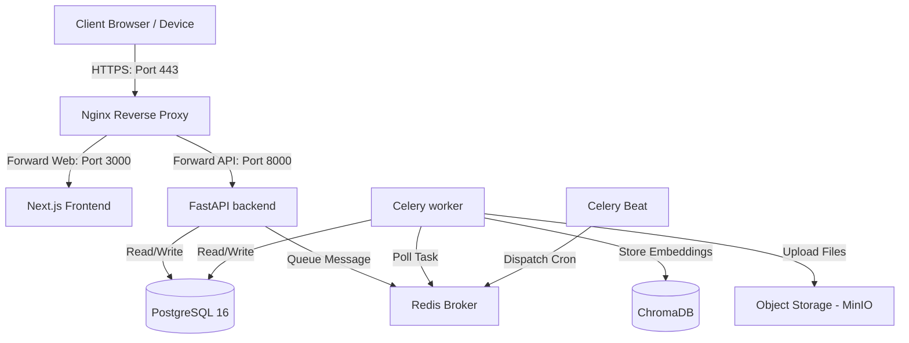

# Aether Production Deployment Runbook

This document describes the production deployment guidelines, infrastructure configuration, secrets encryption keys, SSL/TLS, and verification steps.

---

## 1. Production Architecture Topology



---

## 2. Infrastructure Setup & Network Config

### Docker Compose Build & Bootstrap
To deploy the full topology in production, pull the source, set environment secrets, and execute:
```bash
# Build production images
docker compose build --no-cache

# Run in detached mode
docker compose up -d
```

### Rootless Execution Security
All running containers run under non-root users:
* Backend API/workers execute under user `appuser` (UID 1001).
* Next.js web client executes under user `node-user` (UID 1001).
* Volumes bind to persistent storage paths without root write requirements.

---

## 3. Secrets Management Guidelines

The following environment variables must be defined in your production `.env` and kept out of version control:

| Key | Description | Production Requirement |
|---|---|---|
| `DATABASE_URL` | PostgreSQL connection string | Dedicated cluster URL using SSL (`sslmode=require`) |
| `REDIS_URL` | Redis broker connection string | Auth-protected Redis Cluster |
| `JWT_SECRET` | Token signing secret key | High-entropy string generated with `openssl rand -hex 32` |

---

## 4. SSL/TLS Certificate Configuration

In production, place the Nginx container behind Let's Encrypt Certbot. Example Certbot routing block:
```nginx
server {
    listen 80;
    server_name yourdomain.com;
    location /.well-known/acme-challenge/ {
        root /var/www/certbot;
    }
    location / {
        return 301 https://$host$request_uri;
    }
}
```
Mount SSL certificate directories inside Nginx volume mapping:
```yaml
nginx:
  volumes:
    - /etc/letsencrypt:/etc/letsencrypt:ro
```

---

## 5. Staged Rollout & Post-Deployment Validation

Follow this deployment sequence to ensure zero-downtime updates:
1. **Pre-Deployment Check**: Run local validations runner `.\scripts\validate.ps1`.
2. **Deploy db-init**: Run the schema migrations container (`db-init`) to apply updates.
3. **Deploy API / Workers**: Perform rolling update of the FastAPI server and Celery instances.
4. **Deploy Web**: Perform rolling update of the Next.js frontend application.
5. **Sanity Verification**: Confirm liveness endpoints return `200 OK` at `https://yourdomain.com/v1/health`.
