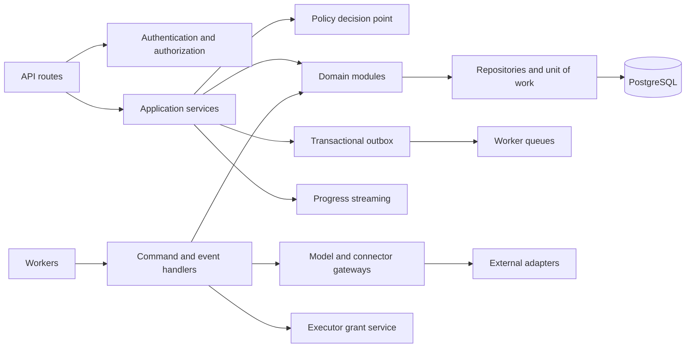
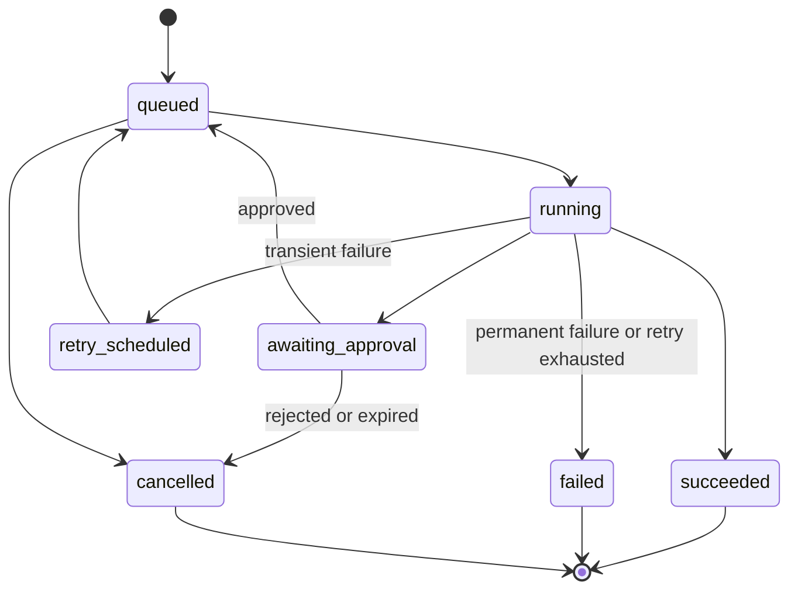

# Component Architecture

## Control plane components

## Layering rules

| Layer          | May depend on                                                       | Must not depend on                                    |
| -------------- | ------------------------------------------------------------------- | ----------------------------------------------------- |
| Presentation   | Application contracts, authentication context.                      | ORM models, provider SDKs, direct database access.    |
| Application    | Domain interfaces, repositories, policy interface, event interface. | Framework request objects, concrete external SDKs.    |
| Domain         | Language/runtime primitives and its own abstractions.               | FastAPI, SQLAlchemy, Celery, provider/connector SDKs. |
| Infrastructure | Domain/application contracts and concrete frameworks.               | Presentation logic.                                   |

## Key component contracts

| Component                   | Input                                           | Output / guarantee                                         |
| --------------------------- | ----------------------------------------------- | ---------------------------------------------------------- |
| Authorization service       | Principal, workspace, resource, action.         | Allow/deny decision with reason and policy version.        |
| Policy decision point       | Tool/action intent, context, risk metadata.     | Allow, deny, or approval requirement; always auditable.    |
| Workflow command service    | Versioned workflow command and idempotency key. | Durable run record and enqueue intent.                     |
| Run state machine           | Current state and event.                        | Only valid transitions; terminal outcomes are immutable.   |
| Model gateway               | Normalized inference request and data policy.   | Normalized streamed result, usage, and provider error.     |
| Connector gateway           | Scoped connection and typed operation.          | Validated result or classified failure; no secret leakage. |
| Knowledge retrieval service | Query, collection scope, principal.             | Ranked, access-checked references with source attribution. |
| Audit service               | Security-relevant event metadata.               | Append-only event with correlation, actor, and outcome.    |

## Agent architecture

Agents are application-level orchestrators, not independent sources of authority. A planner may produce an action plan; a specialized agent may request typed tools; the policy decision point and workflow state machine decide whether execution proceeds. Agent classes share the same contracts for identity, memory scope, provider access, tool authorization, approval, and auditability.

## Workflow state model

