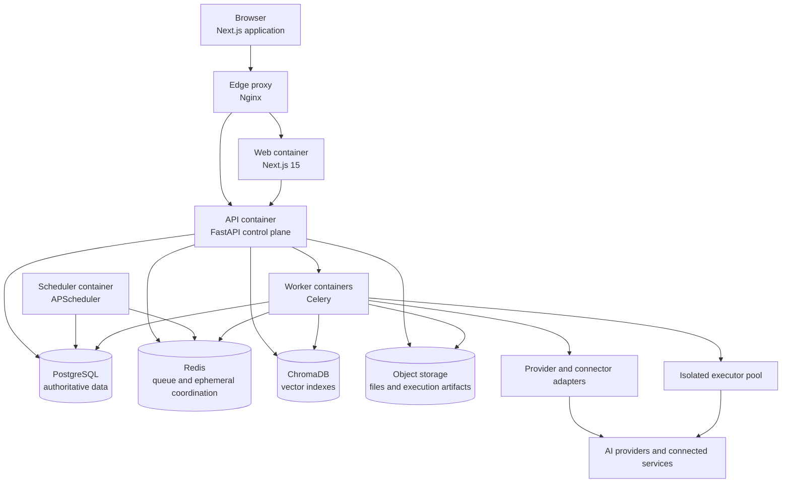

# Container Architecture

## Logical containers

| Container              | Responsibilities                                                                                     | Scaling model                                | Prohibited responsibilities                                        |
| ---------------------- | ---------------------------------------------------------------------------------------------------- | -------------------------------------------- | ------------------------------------------------------------------ |
| Next.js web            | Server-rendered UI, client interaction, session-aware presentation.                                  | Horizontally scalable, stateless.            | Direct database, provider, or secret access.                       |
| Nginx edge proxy       | TLS termination, routing, static compression, request limits.                                        | Replicated or managed load balancer.         | Business authorization decisions.                                  |
| FastAPI control plane  | REST API, authentication, authorization, validation, orchestration commands, streaming coordination. | Horizontally scalable, stateless.            | Long-running work, browser/desktop/code execution.                 |
| Celery workers         | Durable workflows, ingestion, connector calls, notification dispatch, asynchronous AI work.          | Separate pools by workload class and queue.  | Trusting jobs without workspace/policy context.                    |
| APScheduler            | Evaluates due schedules and enqueues idempotent run commands.                                        | Single active scheduler with leader control. | Running workflows inline.                                          |
| PostgreSQL             | Transactional system of record and outbox/audit persistence.                                         | Managed HA configuration in production.      | Unbounded file or vector payload storage.                          |
| Redis                  | Celery broker, locks, rate-limit counters, short-lived caches.                                       | Managed HA configuration in production.      | Authoritative business state.                                      |
| ChromaDB               | Retrieval embeddings and collection indexes.                                                         | Scaled with collection volume.               | Sole copy of source data or access policy.                         |
| Object storage         | Encrypted user files, artifacts, exports, and sanitized captures.                                    | Managed durable storage.                     | Authorization enforcement without control-plane signed access.     |
| Isolated executor pool | Browser automation, desktop automation, constrained Python execution.                                | Ephemeral, per-task or pooled by risk class. | Persisting credentials, direct public ingress, bypassing approval. |

## Communication contracts

- Browser-to-API communication uses HTTPS REST endpoints and authenticated streaming for chat/run progress.
- The API emits transactional outbox events after committed domain changes. A dispatcher delivers them to workers without losing intent on process failure.
- Workers consume named queues and persist state transitions transactionally. They use correlation and causation IDs supplied by the originating request.
- The control plane issues short-lived, task-scoped executor grants. Executors return signed result metadata and artifacts through an internal endpoint.
- Every outbound provider or connector call is mediated by an adapter that enforces timeout, retry, redaction, quota, and audit contracts.
