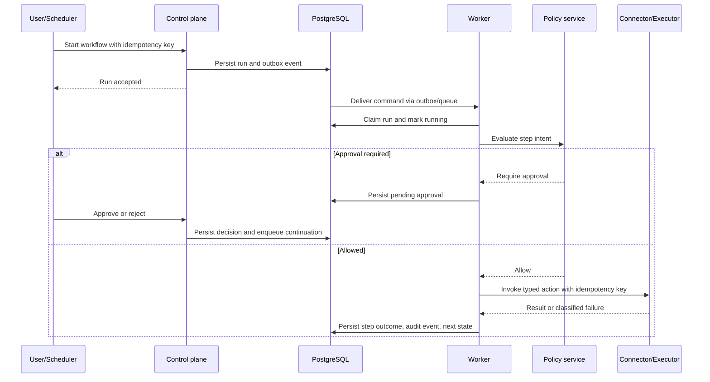

# Data Flows

## Authentication and workspace access

1. The user initiates OAuth with Google or GitHub through the control plane.
2. The API validates state, nonce, issuer, audience, expiration, and code exchange response.
3. The identity domain finds or creates the user and resolves the active organization/workspace membership.
4. The API issues a short-lived access token and a rotating refresh-token family. Refresh tokens are stored as hashes with device/session metadata.
5. Every subsequent request resolves a principal, workspace, and correlation ID before application service invocation.

## AI chat with retrieval and tools

1. The client sends a message, selected model configuration, and conversation ID.
2. The conversation service validates membership, input limits, and content policy; it persists the user message.
3. The retrieval service finds only documents and memories the principal may access and returns source references.
4. The model gateway minimizes and redacts request data according to provider and workspace policy, then streams a normalized completion.
5. Proposed tool calls are persisted as intents and passed to the policy decision point.
6. Allowed, non-sensitive calls are dispatched to a worker; approval-required calls become pending approval records; denied calls are returned with safe explanation.
7. The assistant result, citations, tool lifecycle, usage, and audit records are persisted and streamed to the client.

## Workflow execution

## Knowledge ingestion and retrieval

1. A user uploads a file through a pre-authorized object-storage upload flow.
2. The file domain stores metadata, ownership, classification, retention, and ingestion request in PostgreSQL.
3. A worker virus-scans, parses, chunks, embeds, and writes vector entries tagged with document/version/workspace access metadata.
4. The original file, parser output, ingestion status, and chunk-to-source mapping remain recoverable outside the vector index.
5. Retrieval filters by workspace, collection, document policy, and principal authorization before semantic ranking.

## Deletion and revocation

1. A user or administrator submits a scoped deletion or connection-revocation command.
2. The control plane authorizes the request, marks the relevant resource unavailable for new operations, and records an audit event.
3. Background jobs revoke provider/connector tokens where possible, delete or cryptographically render inaccessible stored content, and remove vector entries and artifacts under retention rules.
4. Completion and exceptions are visible in the activity history; legal holds preserve only permitted minimum records.
