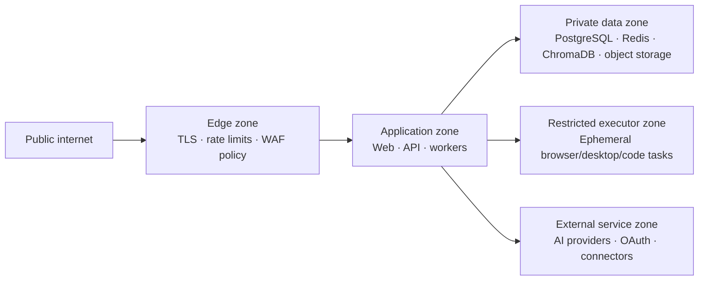

# Security Architecture

## Security objectives

Protect workspace confidentiality and integrity, ensure accountable external actions, minimize AI and integration data exposure, and preserve availability under common application and automation threats.

## Trust zones

## Required controls

| Control area        | Architecture requirement                                                                                                                                                                               |
| ------------------- | ------------------------------------------------------------------------------------------------------------------------------------------------------------------------------------------------------ |
| Authentication      | OAuth 2.0/OIDC authorization-code flow with PKCE, validated callback state/nonce, short-lived access tokens, refresh-token rotation, and session revocation.                                           |
| Authorization       | Deny-by-default RBAC plus workspace/resource checks in API and worker paths. Administrative and API-key scopes are separately constrained.                                                             |
| Secrets             | Store encrypted credential material using envelope encryption with a managed key service in production. Persist only references where feasible; redact secrets in logs, errors, traces, and artifacts. |
| Tenant isolation    | Bind every record, query, cache key, queue payload, vector filter, object key, and executor grant to a workspace. Verify it in automated authorization tests.                                          |
| External actions    | Typed connector operations declare risk class, idempotency behavior, and approval requirements. Policy decisions and outcomes are audited.                                                             |
| AI safety           | Treat retrieved and external text as untrusted; isolate instructions from data; restrict tools; apply output validation; prevent a model from granting authority.                                      |
| Input/output safety | Enforce schema validation, payload and upload limits, content-type checks, malware scanning, SSRF protections, and safe artifact rendering.                                                            |
| Executors           | Use ephemeral identities, short-lived grants, constrained network egress, no host mounts by default, resource limits, artifact capture, and task cleanup.                                              |
| Data protection     | TLS for all transport, encryption at rest, classification and retention metadata, export/deletion workflows, and secure backups.                                                                       |
| Auditability        | Append-only security and action audit events include actor, delegated actor, workspace, target, policy version, correlation ID, timestamp, and outcome.                                                |

## Threat-to-control mapping

| Threat                       | Primary controls                                                                                    |
| ---------------------------- | --------------------------------------------------------------------------------------------------- |
| Broken access control        | Central authorization service, query scoping, authorization tests, least-privilege roles.           |
| Credential theft             | Encrypted secret store, rotation, redaction, scoped tokens, anomaly monitoring.                     |
| Prompt injection             | Untrusted-content boundaries, policy gating, tool allowlists, approval, output schemas.             |
| SSRF and unsafe integrations | Egress allowlists, DNS/IP validation, connector-only network access, timeouts.                      |
| Workflow replay/duplication  | Idempotency keys, state machine, deduplication ledger, immutable action log.                        |
| Malicious file upload        | Size/type limits, quarantine, malware scanning, sandboxed parsing, signed download URLs.            |
| Executor escape              | Ephemeral isolation, resource/network restrictions, no privileged host access, continuous patching. |

## Security verification gates

Before a feature is released, it must have authorization tests, secret-redaction coverage, structured audit coverage for relevant actions, dependency and static analysis, abuse-case tests, and an owner-reviewed threat-model update for any new external action or executor capability.
