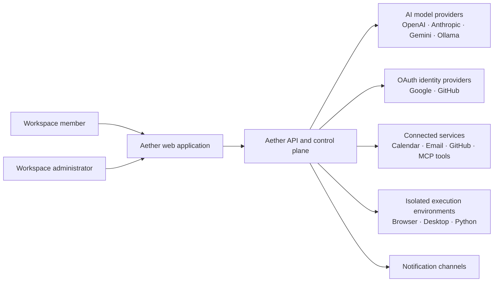

# System Context

## Scope

Aether is a multi-tenant personal AI automation platform. It lets workspace members converse with AI, manage knowledge and memory, create workflows, authorize integrations, and supervise execution. Aether is the policy and orchestration authority; connected systems remain the authority for their own external data.

## Actors and responsibilities

| Actor/system            | Responsibility                                                                          | Trust relationship                                                       |
| ----------------------- | --------------------------------------------------------------------------------------- | ------------------------------------------------------------------------ |
| Workspace member        | Creates content, authorizes integrations, starts work, and approves configured actions. | Authenticated and role-authorized.                                       |
| Workspace administrator | Manages membership, policies, roles, audit access, and organization configuration.      | Elevated, explicitly audited privileges.                                 |
| OAuth identity provider | Authenticates users and grants scoped integration consent.                              | External identity boundary; tokens are validated and protected.          |
| AI model provider       | Produces model inference according to the selected provider and model.                  | External data processor; receives only policy-permitted request content. |
| Connected service       | Performs an approved external action or supplies user-authorized data.                  | External trust boundary; calls use scoped, encrypted credentials.        |
| Isolated executor       | Executes policy-approved browser, desktop, or code tasks.                               | Constrained internal workload; no direct user-facing authority.          |

## Domain boundaries

| Domain               | Owns                                                                                     |
| -------------------- | ---------------------------------------------------------------------------------------- |
| Identity and access  | Users, organizations, workspaces, sessions, roles, API keys, authorization decisions.    |
| Conversations and AI | Conversations, messages, model routing, prompts, tool-call plans, usage.                 |
| Knowledge and memory | Files, documents, collections, ingestion state, retrieval references, user memory.       |
| Automation           | Workflow definitions, versions, schedules, runs, step state, retries, approvals.         |
| Integrations         | Connector definitions, OAuth connections, encrypted credential references, capabilities. |
| Governance           | Policies, audit events, retention rules, security events, consent.                       |
| Notifications        | Delivery preferences, notification requests, delivery outcomes.                          |

No domain may update another domain's tables directly. Cross-domain collaboration occurs through application services, domain events, and declared interfaces.
