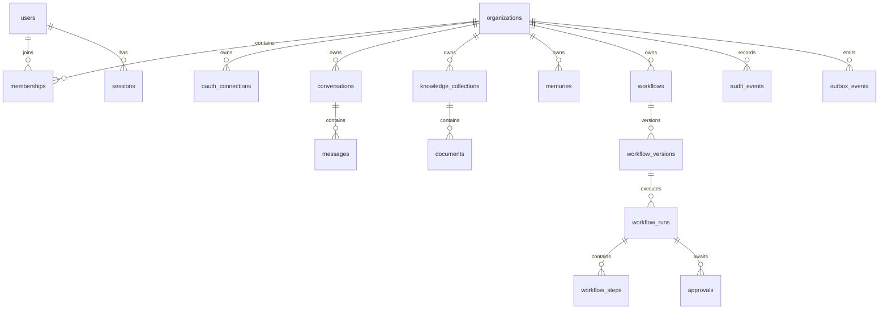

# Phase 4 — Database Design

## Scope

This phase defines the authoritative relational data model for Aether. PostgreSQL is the system of record for identities, authorization, workflow lifecycle, approvals, audit metadata, and user-visible content metadata. Object storage contains file/artifact bytes; ChromaDB contains rebuildable retrieval indexes; Redis contains no authoritative business state.

## Conventions

- All primary keys are UUIDs generated by the application or PostgreSQL.
- Every tenant-owned record has `organization_id`; workspace scoping is represented by the organization in the initial release.
- All timestamps are `timestamptz`, stored in UTC.
- Mutable records include `created_at` and `updated_at`; security/audit records are append-only.
- Enum-like fields use `CHECK` constraints initially to keep schema changes explicit and portable.
- Application queries must always filter by `organization_id`; row-level security is an additional production defense once the deployment identity model is established.

## Entity relationships

## Core data boundaries

| Data class               | Authority                            | Storage                                      | Retention/deletion treatment                                                     |
| ------------------------ | ------------------------------------ | -------------------------------------------- | -------------------------------------------------------------------------------- |
| Identity and membership  | PostgreSQL                           | Relational tables                            | Retain only as required for access, security, and legal obligations.             |
| Credentials and tokens   | PostgreSQL                           | Encrypted ciphertext and non-secret metadata | Revoke promptly; delete encrypted material on disconnection.                     |
| Conversations and memory | PostgreSQL                           | Relational content and structured metadata   | User-scoped export, correction, and deletion controls.                           |
| Files and artifacts      | Object storage + PostgreSQL metadata | Encrypted object with metadata/reference     | Quarantine, lifecycle policy, cryptographic deletion, and vector cleanup.        |
| Knowledge chunks/vectors | PostgreSQL mapping + ChromaDB index  | Rebuildable index                            | Delete index entries with source deletion; source mapping remains authoritative. |
| Workflows and runs       | PostgreSQL                           | Versioned definitions and durable state      | Retain per organization policy; redact sensitive input/output previews.          |
| Audit records            | PostgreSQL                           | Append-only event metadata                   | Restricted access and policy-based retention; minimize direct PII payloads.      |

## Integrity and lifecycle rules

1. Membership uniqueness is enforced by `(organization_id, user_id)`.
2. A workflow run points to an immutable workflow version. Editing a workflow creates a new version.
3. A step is unique within its run by `(run_id, step_key, attempt)`.
4. Approval decisions are immutable after creation; workflow state transitions are validated by application logic and recorded in audit events.
5. External actions use a unique organization-scoped idempotency record before dispatch.
6. An outbox event is committed in the same transaction as its domain change, then delivered asynchronously.
7. Foreign keys cascade only for clearly disposable dependent content. Security, financial, and audit relationships use restrictive or nulling behavior to prevent accidental history loss.

## Indexing and partitioning strategy

- Use composite indexes beginning with `organization_id` for tenant-scoped access patterns.
- Index workflow runs by `(organization_id, status, created_at DESC)` and scheduled work by `(next_run_at)`.
- Index audit events by `(organization_id, occurred_at DESC)` and `(correlation_id)`.
- Use full-text/vector search outside transactional tables; retain document/source joins in PostgreSQL.
- Partition high-volume `audit_events`, `workflow_steps`, and `messages` by month after observed volume justifies it. Initial deployments use the listed indexes to minimize operational complexity.

## Migration contract

Migrations are additive and forward-compatible for rolling deployment. A migration may not remove or rename a populated field until all deployed readers have stopped using it. Every schema change requires a reversible test plan, ownership migration where appropriate, and data-retention impact review.

## Schema artifact

The executable baseline is [0001_core.sql](../../database/schema/0001_core.sql). It deliberately covers foundational state and leaves feature-specific extensions to their corresponding implementation phase, rather than introducing speculative tables.
